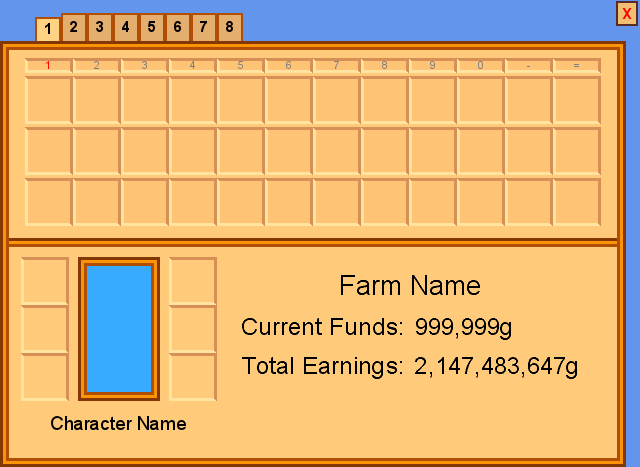
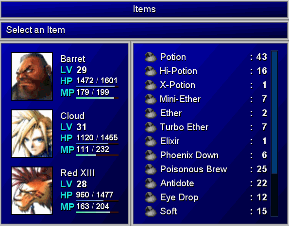
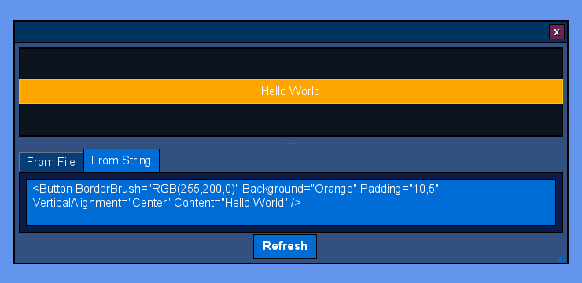

# MGUI

MGUI is a UI framework for [MonoGame](https://www.monogame.net/) ([Src](https://github.com/MonoGame/MonoGame)) that features a powerful layout engine and data binding engine similar to WPF, and a robust set of controls to build your UI with. 

All control names are prefixed with 'MG' and have similar names and properties to what you might find in WPF. Currently supported controls:
- 'Container'-like Controls that define their own logic for arranging their children:
  - MGDockPanel
  - MGGrid
  - MGOverlayPanel
  - MGStackPanel
  - MGUniformGrid
- Controls that can have child Content:
  - MGBorder
  - MGButton
  - MGCheckBox
  - MGComboBox
  - MGContextMenu
  - MGContextMenuItem
  - MGXAMLDesigner
  - MGExpander
  - MGGroupBox
  - MGListBox
  - MGListView
  - MGRadioButton
  - MGScrollViewer
  - MGTabControl
  - MGTabItem
  - MGToggleButton
  - MGToolTip
  - MGWindow
- Controls that cannot have child Content:
  - MGGridSplitter
  - MGImage
  - MGPasswordBox
  - MGProgressBar
  - MGRatingControl
  - MGResizeGrip
  - MGSeparator
  - MGSlider
  - MGStopwatch
  - MGTextBlock
  - MGTextBox
  - MGTimer
  
[Wiki is under construction.](https://github.com/Videogamers0/MGUI/wiki) More documentation coming soon... maybe...
  
# Examples
  
A simple registration window created with MGUI:


<details>
  <summary>XAML Markup:</summary>
  
```xaml
<Window xmlns="clr-namespace:MGUI.Core.UI.XAML;assembly=MGUI.Core"
        xmlns:x="http://schemas.microsoft.com/winfx/2006/xaml"
        Left="440" Top="20" MinWidth="300" SizeToContent="Height">

    <!-- Replace the window's Title bar with custom content -->
    <Window.TitleBar>
        <!-- The root-element of the window's Title bar must always be an DockPanel, but we can add whatever we want to it -->
        <DockPanel Padding="5,2">
            <Rectangle Dock="Left" Width="16" Height="16" Stroke="Gray" StrokeThickness="1" Fill="Black" Margin="0,0,5,0">
                <Rectangle.ToolTip>
                    <ToolTip Padding="8,4" MinHeight="0" SizeToContent="WidthAndHeight" TextForeground="RoyalBlue" Background="White * 0.85">
                        <TextBlock HorizontalAlignment="Center" VerticalAlignment="Center" Text="[b]Pretend this is a window icon[/b]" />
                    </ToolTip>
                </Rectangle.ToolTip>
            </Rectangle>

            <TextBlock FontSize="10" Foreground="White" Text="Registration Form" />
        </DockPanel>
    </Window.TitleBar>

    <DockPanel Margin="5">
        <!-- Window header -->
        <StackPanel Dock="Top" Orientation="Vertical">
            <TextBlock Dock="Top" HorizontalAlignment="Center" FontSize="14" Foreground="Orange" Text="Register for a new account" />
            <Separator Size="3" Orientation="Horizontal" Background="Orange * 0.5" />
        </StackPanel>

        <!-- Register -->
        <Button Name="Button_Register" Dock="Bottom" Background="Orange" HorizontalAlignment="Center" Padding="25,5">
            <TextBlock Text="[b]Register[/b]" FontSize="14" />
        </Button>

        <Border BorderBrush="Black" BorderThickness="1">
            <ScrollViewer VerticalScrollBarVisibility="Auto" HorizontalScrollBarVisibility="Disabled" Padding="8" Margin="0,10,0,15" Background="White * 0.08">
                <StackPanel Orientation="Vertical">
                    <StackPanel.Styles>
                        <Style TargetType="HeaderedContentPresenter">
                            <Setter Property="HeaderPosition" Value="Top" />
                            <Setter Property="Spacing" Value="2" />
                        </Style>
                    </StackPanel.Styles>

                    <!-- Email -->
                    <HeaderedContentPresenter>
                        <HeaderedContentPresenter.Header>
                            <TextBlock Text="Email:" Foreground="Gray" />
                        </HeaderedContentPresenter.Header>
                        <TextBox Name="TextBox_Email" PlaceholderText="[i][opacity=0.5]Email[/opacity][/i]" CharacterLimit="40" ShowCharacterCount="false" AcceptsReturn="false" AcceptsTab="false" />
                    </HeaderedContentPresenter>
                    <Spacer Height="8" />

                    <!-- Username -->
                    <HeaderedContentPresenter>
                        <HeaderedContentPresenter.Header>
                            <TextBlock Text="Username:" Foreground="Gray" />
                        </HeaderedContentPresenter.Header>
                        <TextBox Name="TextBox_Username" PlaceholderText="[i][opacity=0.5]Username[/opacity][/i]" CharacterLimit="16" ShowCharacterCount="true" AcceptsReturn="false" AcceptsTab="false">
                            <TextBox.ToolTip>
                                <ToolTip SizeToContent="WidthAndHeight" TextForeground="Red" HorizontalContentAlignment="Center" VerticalContentAlignment="Center">
                                    <TextBlock WrapText="True" LinePadding="10" FontSize="10" Text="Must contain only alphanumeric characters.\nCannot exceed [b]16[/b] characters." />
                                </ToolTip>
                            </TextBox.ToolTip>
                        </TextBox>
                    </HeaderedContentPresenter>
                    <Spacer Height="8" />

                    <!-- Password -->
                    <HeaderedContentPresenter>
                        <HeaderedContentPresenter.Header>
                            <TextBlock Text="Password:" Foreground="Gray" />
                        </HeaderedContentPresenter.Header>
                        <PasswordBox Name="TextBox_Password" PasswordCharacter="*" Text="Hunter2" />
                    </HeaderedContentPresenter>
                    <Spacer Height="16" />

                    <!-- Terms of service -->
                    <CheckBox Name="CheckBox_TOS" IsChecked="true">
                        <TextBlock Text="I agree to the [Action=OpenTOS][color=#3483eb][i][u]Terms of service[/u][/i][/color][/Action]" />
                    </CheckBox>
                </StackPanel>
            </ScrollViewer>
        </Border>
    </DockPanel>
</Window>
```
</details>


<details>
  <summary>XAML Markup</summary>

```xaml
<Window xmlns="clr-namespace:MGUI.Core.UI.XAML;assembly=MGUI.Core"
        xmlns:x="http://schemas.microsoft.com/winfx/2006/xaml"
        Left="420" Top="20" SizeToContent="WidthAndHeight" WindowStyle="None" AllowsClickThrough="True">
    <OverlayPanel TextForeground="Black" HorizontalAlignment="Center" VerticalAlignment="Center">
        <Button Name="Button_Close" HorizontalAlignment="Right" VerticalAlignment="Top" Content="[b]X" TextForeground="Red" Padding="3,2,3,0"
                BorderBrush="RGB(91,43,42)" BorderThickness="2" Background="rgb(242,191,114)" ZIndex="100" />

        <InputConsumer Margin="0,12,12,0">
            <TabControl Background="RGB(255,203,123)" BorderBrush="RGB(177,78,5)" BorderThickness="0" MinWidth="300" MinHeight="300" Padding="0">
                <TabControl.HeadersPanel>
                    <StackPanel Orientation="Horizontal" Margin="35,0,0,0" Spacing="0" />
                </TabControl.HeadersPanel>
                <TabControl.SelectedTabHeaderTemplate>
                    <Button Padding="2,1" BorderThickness="2,2,2,0" BorderBrush="rgb(177,78,5)" Background="rgb(255,210,132)" VerticalAlignment="Bottom" />
                </TabControl.SelectedTabHeaderTemplate>
                <TabControl.UnselectedTabHeaderTemplate>
                    <Button Padding="2,3" BorderThickness="2,2,2,0" BorderBrush="rgb(177,78,5)" Background="rgb(228,174,110)" VerticalAlignment="Bottom" />
                </TabControl.UnselectedTabHeaderTemplate>

                <TabItem Padding="0">
                    <TabItem.Header>
                        <TextBlock Text="[b]1" Foreground="Black" Padding="5,2" />
                    </TabItem.Header>

                    <!-- Content of the first tab -->
                    <Border BorderThickness="9">
                        <Border.BorderBrush>
                            <BandedBorderBrush>
                                <BorderBand Brush="RGB(133,54,5)" />
                                <BorderBand Brush="RGB(250,147,5)" />
                                <BorderBand Brush="RGB(177,78,5)" />
                            </BandedBorderBrush>
                        </Border.BorderBrush>

                        <StackPanel Orientation="Vertical">

                            <!-- 4x12 grid of 48x48 px slots -->
                            <UniformGrid Name="UniformGrid_Inventory" Rows="4" Columns="12" CellSize="48,48" Margin="16,8,16,12" HeaderRowHeight="15" RowSpacing="3">
                                <UniformGrid.Styles>
                                    <Style TargetType="TextBlock">
                                        <Setter Property="Foreground" Value="Gray" />
                                        <Setter Property="FontSize" Value="8" />
                                        <Setter Property="HorizontalAlignment" Value="Center" />
                                        <Setter Property="VerticalAlignment" Value="Center" />
                                    </Style>
                                </UniformGrid.Styles>
                                <TextBlock Foreground="Red" Text="1" Row="0" Column="0" />
                                <TextBlock Text="2" Row="0" Column="1" />
                                <TextBlock Text="3" Row="0" Column="2" />
                                <TextBlock Text="4" Row="0" Column="3" />
                                <TextBlock Text="5" Row="0" Column="4" />
                                <TextBlock Text="6" Row="0" Column="5" />
                                <TextBlock Text="7" Row="0" Column="6" />
                                <TextBlock Text="8" Row="0" Column="7" />
                                <TextBlock Text="9" Row="0" Column="8" />
                                <TextBlock Text="0" Row="0" Column="9" />
                                <TextBlock Text="-" Row="0" Column="10" />
                                <TextBlock Text="=" Row="0" Column="11" />
                            </UniformGrid>

                            <Separator Orientation="Horizontal" Size="3" Margin="0" Background="RGB(133,54,5)" />
                            <Separator Orientation="Horizontal" Size="3" Margin="0" Background="RGB(250,147,5)" />
                            <Separator Orientation="Horizontal" Size="3" Margin="0" Background="RGB(177,78,5)" />

                            <DockPanel Margin="12,10,12,12">
                                <Grid Dock="Left" RowLengths="48,48,48,auto" ColumnLengths="48,100,48">
                                    <!-- Note: If you specify 4 colors, delimited by a hyphen, it will create an MGDockedBorderBrush (Left, Top, Right, Bottom) -->
                                    <Border Row="0" Column="0" BorderBrush="RGB(255,228,161)-RGB(214,143,84)-RGB(214,143,84)-RGB(255,228,161)" BorderThickness="3" />
                                    <Border Row="1" Column="0" BorderBrush="RGB(255,228,161)-RGB(214,143,84)-RGB(214,143,84)-RGB(255,228,161)" BorderThickness="3" />
                                    <Border Row="2" Column="0" BorderBrush="RGB(255,228,161)-RGB(214,143,84)-RGB(214,143,84)-RGB(255,228,161)" BorderThickness="3" />

                                    <Border Row="0" Column="1" RowSpan="3" Margin="9,0" BorderThickness="9" Background="RGB(56,170,255)">
                                        <Border.BorderBrush>
                                            <BandedBorderBrush>
                                                <BorderBand Brush="RGB(133,54,5)" />
                                                <BorderBand Brush="RGB(250,147,5)" />
                                                <BorderBand Brush="RGB(177,78,5)" />
                                            </BandedBorderBrush>
                                        </Border.BorderBrush>

                                        <!--<Image Texture="texture_name..."></Image>-->
                                    </Border>

                                    <Border Row="0" Column="2" BorderBrush="RGB(255,228,161)-RGB(214,143,84)-RGB(214,143,84)-RGB(255,228,161)" BorderThickness="3" />
                                    <Border Row="1" Column="2" BorderBrush="RGB(255,228,161)-RGB(214,143,84)-RGB(214,143,84)-RGB(255,228,161)" BorderThickness="3" />
                                    <Border Row="2" Column="2" BorderBrush="RGB(255,228,161)-RGB(214,143,84)-RGB(214,143,84)-RGB(255,228,161)" BorderThickness="3" />

                                    <TextBlock Row="3" Column="0" ColumnSpan="3" Margin="0,12,0,0" Text="Character Name" HorizontalAlignment="Center" FontSize="14" />
                                </Grid>

                                <StackPanel Orientation="Vertical" HorizontalAlignment="Center" VerticalAlignment="Center" Spacing="12" Margin="15,15,15,65">
                                    <TextBlock Text="Farm Name" FontSize="20" HorizontalAlignment="Center" />
                                    <Grid HorizontalAlignment="Center" RowSpacing="12" ColumnSpacing="8" RowLengths="auto,auto" ColumnLengths="auto,auto">
                                        <TextBlock Row="0" Column="0" Text="Current Funds:" FontSize="18" HorizontalAlignment="Right" />
                                        <TextBlock Row="0" Column="1"  Text="999,999g" FontSize="18" HorizontalAlignment="Left" />

                                        <TextBlock Row="1" Column="0" Text="Total Earnings:" FontSize="18" HorizontalAlignment="Right" />
                                        <TextBlock Row="1" Column="1" Text="2,147,483,647g" FontSize="18" HorizontalAlignment="Left" />
                                    </Grid>
                                </StackPanel>
                            </DockPanel>
                        </StackPanel>
                    </Border>
                </TabItem>
                <TabItem>
                    <TabItem.Header>
                        <TextBlock Text="[b]2" Foreground="Black" Padding="5,2" />
                    </TabItem.Header>
                </TabItem>
                <TabItem>
                    <TabItem.Header>
                        <TextBlock Text="[b]3" Foreground="Black" Padding="5,2" />
                    </TabItem.Header>
                </TabItem>
                <TabItem>
                    <TabItem.Header>
                        <TextBlock Text="[b]4" Foreground="Black" Padding="5,2" />
                    </TabItem.Header>
                </TabItem>
                <TabItem>
                    <TabItem.Header>
                        <TextBlock Text="[b]5" Foreground="Black" Padding="5,2" />
                    </TabItem.Header>
                </TabItem>
                <TabItem>
                    <TabItem.Header>
                        <TextBlock Text="[b]6" Foreground="Black" Padding="5,2" />
                    </TabItem.Header>
                </TabItem>
                <TabItem>
                    <TabItem.Header>
                        <TextBlock Text="[b]7" Foreground="Black" Padding="5,2" />
                    </TabItem.Header>
                </TabItem>
                <TabItem>
                    <TabItem.Header>
                        <TextBlock Text="[b]8" Foreground="Black" Padding="5,2" />
                    </TabItem.Header>
                </TabItem>
            </TabControl>
        </InputConsumer>
    </OverlayPanel>
</Window>
```
</details>


<details>
  <summary>XAML Markup</summary>
  
```xaml
<Window xmlns="clr-namespace:MGUI.Core.UI.XAML;assembly=MGUI.Core"
        xmlns:x="http://schemas.microsoft.com/winfx/2006/xaml"
        xmlns:local="clr-namespace:MGUI.Samples.Dialogs.FF7;assembly=MGUI.Samples"
        WindowStyle="None" Width="600" Height="470">
    <OverlayPanel>
        <OverlayPanel.Styles>
            <Style TargetType="TextBlock">
                <Setter Property="FontSize" Value="14" />
                <Setter Property="Foreground" Value="rgb(236,236,236)" />
                <Setter Property="IsShadowed" Value="True" />
                <Setter Property="ShadowColor" Value="Black" />
                <Setter Property="ShadowOffset" Value="1,2" />
            </Style>
            <Style TargetType="Border" Name="PanelBorder">
                <Setter Property="BorderBrush">
                    <Setter.Value>
                        <BandedBorderBrush>
                            <BorderBand Brush="rgb(128,128,128)" />
                            <BorderBand Brush="rgb(168,168,168)" />
                            <BorderBand Brush="rgb(198,198,198)" />
                            <BorderBand Brush="rgb(210,210,210)" />
                            <BorderBand Brush="rgb(148,148,148)" />
                            <BorderBand Brush="rgb(85,85,104)" />
                        </BandedBorderBrush>
                    </Setter.Value>
                </Setter>
                <Setter Property="BorderThickness" Value="6" />
                <Setter Property="Background" Value="rgb(0,0,180)|rgb(0,0,50)" />
                <Setter Property="Padding" Value="8,4" />
            </Style>
        </OverlayPanel.Styles>

        <DockPanel>
            <Border StyleNames="PanelBorder" Dock="Top">
                <TextBlock HorizontalAlignment="Center" FontSize="14" Text="Items" />
            </Border>
            <Border StyleNames="PanelBorder" Dock="Top">
                <TextBlock HorizontalAlignment="Left" AllowsInlineFormatting="False"
                           Text="{MGBinding Path=SelectedItem.Description, Mode=OneWay, FallbackValue='Select an Item'}" />
            </Border>

            <DockPanel>
                <Border StyleNames="PanelBorder" Dock="Left">
                    <!-- List of each party member -->
                    <ListBox Name="PartyList" ItemType="{x:Type local:PartyMember}" IsTitleVisible="False" Background="Transparent" 
                             Margin="5" AlternatingRowBackgrounds="{x:Null}" ItemsPanelBorderThickness="0" SelectionMode="None">
                        <ListBox.ItemContainerStyle>
                            <Border BorderThickness="0" />
                        </ListBox.ItemContainerStyle>
                        <ListBox.ItemTemplate>
                            <ContentTemplate>
                                <DockPanel Margin="0,5">
                                    <DockPanel.Styles>
                                        <Style TargetType="TextBlock" Name="HeaderLabel">
                                            <Setter Property="IsBold" Value="True" />
                                            <Setter Property="Foreground" Value="rgb(24,215,215)" />
                                            <Setter Property="Margin" Value="0,0,1,0" />
                                            <Setter Property="MinWidth" Value="32" />
                                            <Setter Property="TextAlignment" Value="Left" />
                                            <Setter Property="VerticalAlignment" Value="Center" />
                                        </Style>
                                    </DockPanel.Styles>

                                    <!-- Character Portrait -->
                                    <Border BorderBrush="Black" BorderThickness="2" Dock="Left" Margin="0,0,6,0" VerticalAlignment="Center">
                                        <Image Stretch="None" Texture="{MGBinding Path=Portrait, Mode=OneTime}" />
                                    </Border>

                                    <StackPanel Margin="8,0,0,0" VerticalAlignment="Center" Orientation="Vertical">
                                        <!-- Character Name -->
                                        <TextBlock Text="{MGBinding Path=Name, Mode=OneTime, FallbackValue='&lt;Name&gt;'}" />

                                        <!-- Character Level -->
                                        <DockPanel>
                                            <TextBlock StyleNames="HeaderLabel" Dock="Left" Text="LV" />
                                            <TextBlock Foreground="White" IsBold="True" Text="{MGBinding Path=Level, Mode=OneWay}" />
                                        </DockPanel>

                                        <!-- Character HP -->
                                        <DockPanel>
                                            <TextBlock StyleNames="HeaderLabel" Dock="Left" Text="HP" />
                                            <DockPanel VerticalAlignment="Center">
                                                <!-- Tip: If you specify 4 colors, delimited by a '|', it will create an MGGradientBrush using those colors as the 4 corners of the gradient -->
                                                <ProgressBar Dock="Bottom" Height="4" BorderThickness="0,0,0,1" BorderBrush="Black"
                                                         Minimum="0" Maximum="{MGBinding Path=MaxHP, Mode=OneWay}" Value="{MGBinding Path=CurrentHP, Mode=OneWay}"
                                                         CompletedBrush="rgb(56,114,217)|rgb(155,178,220)|rgb(155,178,220)|rgb(56,114,217)" 
                                                         IncompleteBrush="rgb(60,0,0)" />
                                                <StackPanel Orientation="Horizontal">
                                                    <TextBlock Foreground="White" IsBold="True" FontSize="12" Text="{MGBinding Path=CurrentHP, Mode=OneWay}" />
                                                    <TextBlock Margin="3,0" Text="/" FontSize="12" />
                                                    <TextBlock Foreground="White" IsBold="True" FontSize="12" Text="{MGBinding Path=MaxHP, Mode=OneWay}" />
                                                </StackPanel>
                                            </DockPanel>
                                        </DockPanel>

                                        <!-- Character MP -->
                                        <DockPanel>
                                            <TextBlock StyleNames="HeaderLabel" Dock="Left" Text="MP" />
                                            <DockPanel VerticalAlignment="Center">
                                                <ProgressBar Dock="Bottom" Height="4" BorderThickness="0,0,0,1" BorderBrush="Black"
                                                         Minimum="0" Maximum="{MGBinding Path=MaxMP, Mode=OneWay}" Value="{MGBinding Path=CurrentMP, Mode=OneWay}"
                                                         CompletedBrush="rgb(65,217,152)|rgb(170,205,196)|rgb(170,205,196)|rgb(65,217,152)" 
                                                         IncompleteBrush="rgb(60,0,0)" />
                                                <StackPanel Orientation="Horizontal">
                                                    <TextBlock Foreground="White" IsBold="True" FontSize="12" Text="{MGBinding Path=CurrentMP, Mode=OneWay}" />
                                                    <TextBlock Margin="3,0" Text="/" FontSize="12" />
                                                    <TextBlock Foreground="White" IsBold="True" FontSize="12" Text="{MGBinding Path=MaxMP, Mode=OneWay}" />
                                                </StackPanel>
                                            </DockPanel>
                                        </DockPanel>
                                    </StackPanel>
                                </DockPanel>
                            </ContentTemplate>
                        </ListBox.ItemTemplate>
                    </ListBox>
                </Border>

                <Border StyleNames="PanelBorder">
                    <!-- List of each item in the inventory -->
                    <ListBox Name="ItemsList" ItemType="{x:Type local:InventoryItem}" IsTitleVisible="False" Background="Transparent" 
                             Margin="10" AlternatingRowBackgrounds="{x:Null}" ItemsPanelBorderThickness="0">
                        <ListBox.ItemTemplate>
                            <ContentTemplate>
                                <DockPanel>
                                    <!-- Name and icon -->
                                    <StackPanel Orientation="Horizontal" Dock="Left" Spacing="5">
                                        <Image VerticalAlignment="Center" TextureName="FF7ItemIcon" Width="24" Height="22" />
                                        <TextBlock VerticalAlignment="Center" Text="{MGBinding Path=Name, Mode=OneTime}" />
                                    </StackPanel>

                                    <!-- Quantity -->
                                    <StackPanel Orientation="Horizontal" Spacing="5" HorizontalAlignment="Right">
                                        <TextBlock VerticalAlignment="Center" Text=":" IsBold="True" />
                                        <TextBlock VerticalAlignment="Center" Text="{MGBinding Path=Quantity, Mode=OneWay}" 
                                               MinWidth="24" TextAlignment="Right" IsBold="True" />
                                    </StackPanel>
                                </DockPanel>
                            </ContentTemplate>
                        </ListBox.ItemTemplate>
                    </ListBox>
                </Border>
            </DockPanel>
        </DockPanel>

        <!-- Button in the top-right corner that closes the dialog -->
        <Button Name="CloseButton" HorizontalAlignment="Right" VerticalAlignment="Top" Margin="8" Background="Transparent" BorderThickness="0" Padding="2,0">
            <TextBlock IsBold="True" Text="x" Foreground="Crimson" />
        </Button>
    </OverlayPanel>
</Window>
```
</details>

  
MGUI can also parse and render your XAML markup at runtime using the MGXAMLDesigner control:

  
# Getting Started:

1. Clone this repo
2. Use Visual Studio 2022 (since this project targets .NET 6.0, and makes use of some new-ish C# language features such as record structs)
3. In your MonoGame project:
   - In the Solution Explorer:
     - Right-click your Solution, *Add* -> *Existing Project*. Browse for `MGUI.Shared.csproj`, and `MGUI.Core.csproj`.
     - Right-click your Project, *Add* -> *Project Reference*. Add references to `MGUI.Shared and MGUI.Core`.
     - You may need to:
       - Right-click your game's *Content* folder, *Add* -> *Existing Item*. Browse for `MGUI\MGUI.Shared\Content\MGUI.Shared.Content.mgcb` and `MGUI\MGUI.Core\Content\MGUI.Core.Content.mgcb` and add them both as links (in the file browser dialog, click the dropdown arrow next to the *Add* button and choose *Add as link*). This is intended to ensure MGUI's content .xnb files are copied to your project's bin\Content folder. This step might not be necessary.
   - In your Game class:
     - In the Initialize method:
       - Instantiate `MGUI.Shared.Rendering.MainRenderer`
       - Instantiate `MGUI.Core.UI.MGDesktop`
     - Anywhere in your code, instantiate 1 or more `MGWindow` and add them to your `MGDesktop` instance via `MGDesktop.Windows`
     - In the Update method: Call `MGDesktop.Update()`
     - In the Draw method: Call `MGDesktop.Draw()`
      
<details>
  <summary>Example code for your Game class:</summary>

```c#
public class Game1 : Game, IObservableUpdate
{
    private GraphicsDeviceManager _graphics;
    private SpriteBatch _spriteBatch;

    private MainRenderer MGUIRenderer { get; set; }
    private MGDesktop Desktop { get; set; }

    public event EventHandler<TimeSpan> PreviewUpdate;
    public event EventHandler<EventArgs> EndUpdate;

    public Game1()
    {
        _graphics = new GraphicsDeviceManager(this);
        Content.RootDirectory = "Content";
        IsMouseVisible = true;
    }

    protected override void Initialize()
    {
        this.MGUIRenderer = new(new GameRenderHost<Game1>(this));
        this.Desktop = new(MGUIRenderer);

        MGWindow Window1 = new(Desktop, 50, 50, 500, 200);
        Window1.TitleText = "Sample Window with a single [b]Button[/b]: [color=yellow]Click it![/color]";
        Window1.BackgroundBrush.NormalValue = new MGSolidFillBrush(Color.Orange);
        Window1.Padding = new(15);
        MGButton Button1 = new(Window1, button => { button.SetContent("I've been clicked!"); });
        Button1.SetContent("Click me!");
        Window1.SetContent(Button1);

        this.Desktop.Windows.Add(Window1);

        base.Initialize();
    }

    protected override void LoadContent()
    {
        _spriteBatch = new SpriteBatch(GraphicsDevice);
    }

    protected override void Update(GameTime gameTime)
    {
        PreviewUpdate?.Invoke(this, gameTime.TotalGameTime);

        Desktop.Update();
        // TODO: Add your update logic here

        base.Update(gameTime);

        EndUpdate?.Invoke(this, EventArgs.Empty);
    }

    protected override void Draw(GameTime gameTime)
    {
        GraphicsDevice.Clear(Color.CornflowerBlue);

        // TODO: Add your drawing code here
        Desktop.Draw();

        base.Draw(gameTime);
    }
}
```


</details>
  
# Multi-Platform

MGUI.Core targets `net6.0-windows` by default. If you wish to use MGUI on another OS, open `MGUI\MGUI.Core\MGUI.Core.csproj` and change `<TargetFramework>net6.0-windows</TargetFramework>` to `<TargetFramework>net6.0</TargetFramework>`. Some features have better implementations when targeting `net6.0-windows`, but everything probably™ works fine when targeting `net6.0`. In particular, targeting `net6.0` breaks some intellisense related to `MarkupExtensions` (such as `MGBinding`) when using the Visual Studio Xaml designer (but it still works at runtime).

# Input Handling

MGUI uses its own framework to detect and respond to inputs.

- `InputTracker`
  - The base-class for input-related logic
  - Uusually only 1 instance per program, automatically created when you create an instance of `MGUI.Shared.Rendering.MainRenderer`
  - Contains 2 child objects: `MouseTracker` and `KeyboardTracker`
- `MouseTracker`
  - Detects changes to the `MouseState` and stores information about those changes in EventArg objects, most of which have an `IsHandled` property.
  - Manages 0 to many `MouseHandlers`
  - `MouseHandler`
    - Exposes several events that your code can subscribe to, to react to mouse events. Such as:
      - `Scrolled`, `MovedInside`, `MovedOutside`, `Entered`, `Exited`, `PressedInside`, `PressedOutside`, `ReleasedInside`, `ReleasedOutside`, `DragStart`, `Dragged`, `DragEnd`
    - Prevents the same event from being invoked to several subscribers after one of the subscribers handles it (by setting `IsHandled` to `true`)
- `KeyboardTracker`
  - Just like `MouseTracker` except for managing Keyboard-related inputs.
        
If you'd like to utilize this framework in your own code, get the `InputTracker` instance from your `MGUI.Shared.Rendering.MainRenderer` instance, then get the `MouseTracker` and/or `KeyboardTracker` instance from the `InputTracker`. Call `MouseTracker.CreateHandler(...)`/`KeyboardTracker.CreateHandler(...)`, and subscribe to the events in the returned handler instance.

<details>
  <summary>Example code:</summary>
  
Suppose you want to react to WASD keys to move your player, but you don't want to move the player if the WASD was handled by an `MGTextBox` on the UI:

```c#
public class Game1 : Game, IObservableUpdate, IKeyboardHandlerHost
{
    private GraphicsDeviceManager _graphics;
    private SpriteBatch _spriteBatch;

    private MainRenderer MGUIRenderer { get; set; }
    private MGDesktop Desktop { get; set; }

    public event EventHandler<TimeSpan> PreviewUpdate;
    public event EventHandler<EventArgs> EndUpdate;

    public Game1()
    {
        _graphics = new GraphicsDeviceManager(this);
        Content.RootDirectory = "Content";
        IsMouseVisible = true;
    }

    private KeyboardHandler PlayerMovementHandler;

    protected override void Initialize()
    {
        _graphics.PreferredBackBufferWidth = 400;
        _graphics.PreferredBackBufferHeight = 300;
        _graphics.ApplyChanges();

        this.MGUIRenderer = new(new GameRenderHost<Game1>(this));
        this.Desktop = new(MGUIRenderer);

        // Create a simple UI that may need to handle keyboard events
        MGWindow Window1 = new(Desktop, 20, 20, 200, 100);
        Window1.Padding = new(10);
        MGTextBox TextBox = new(Window1);
        Window1.SetContent(TextBox);
        Desktop.Windows.Add(Window1);

        //  Create a KeyboardHandler instance that will respond to WASD key presses
        PlayerMovementHandler = MGUIRenderer.Input.Keyboard.CreateHandler(this, null);
        PlayerMovementHandler.Pressed += (sender, e) =>
        {
            if (e.Key is Keys.W or Keys.A or Keys.S or Keys.D)
            {
                //TODO Move the player
                e.SetHandled(this, false);
            }
        };

        base.Initialize();
    }

    protected override void LoadContent()
    {
        _spriteBatch = new SpriteBatch(GraphicsDevice);
    }

    protected override void Update(GameTime gameTime)
    {
        PreviewUpdate?.Invoke(this, gameTime.TotalGameTime);

        Desktop.Update();

        // By updating this handler AFTER we've updated our UI, the handler won't receive events that were already handled by our UI's TextBox
        PlayerMovementHandler.ManualUpdate();

        // TODO: Add your update logic here
        base.Update(gameTime);

        EndUpdate?.Invoke(this, EventArgs.Empty);
    }

    protected override void Draw(GameTime gameTime)
    {
        GraphicsDevice.Clear(Color.CornflowerBlue);
        // TODO: Add your drawing code here
        Desktop.Draw();
        base.Draw(gameTime);
    }
}
```

If you don't want to use MGUI's input framework, then you can just check if the EventArgs in `MouseTracker`/`KeyboardTracker` have already been handled before your code attempts to handle them:

```c#
BaseKeyPressedEventArgs W_PressEvent = MGUIRenderer.Input.Keyboard.CurrentKeyPressedEvents[Keys.W];
if (Keyboard.GetState().IsKeyDown(Keys.W) && (W_PressEvent == null || !W_PressEvent.IsHandled))
{
    //TODO do something
}
```
</details>

# DataBinding

MGUI has its own DataBinding engine to allow you to bind UI data to data in your `DataContext`. Set `MGWindow.WindowDataContext` or `MGElement.DataContextOverride`. Then you can use the `MGBinding` markup extension in XAML to configure your bindings.

```xaml
<Window xmlns="clr-namespace:MGUI.Core.UI.XAML;assembly=MGUI.Core"
        SizeToContent="WidthAndHeight" TitleText="DataBindings" Padding="10">
        <TextBlock Text="{MGBinding Path=SomeSampleString, Mode=OneWay}" />
</Window>
```

`{MGBinding Path=SomeSampleString, Mode=OneWay}` creates a `DataBinding` that will automatically set `TextBlock.Text = TextBlock.DataContext.SomeSampleString;`

MGUI's DataBinding engine supports several features such as:
- Binding Modes (`OneTime`, `OneWay`, `OneWayToSource`, `TwoWay`)
- Binding to nested properties (`{MGBinding Path=Foo.Bar}`)
- Binding to specific named elements (`{MGBinding ElementName=SomeNamedCheckBox, Path=IsChecked}`)
- Binding with a `Converter` (`{MGBinding Path=SomeValue, Converter={local:BoolToVisibilityConverter}}`)
- Binding with a `StringFormat` (`{MGBinding Path=SomeFloatValue, StringFormat={}{0:0.0}}`)
- and more. Check the DataBinding window in the Samples project for detailed documentation:


Because MGUI uses its own DataBinding engine, DataBindings will work even on non-Windows platforms. (Though you will need to change `MGUI.Core` to target `net6.0` instead of `net6.0-windows`, and some intellisense won't work in the Visual Studio Xaml designer.)
